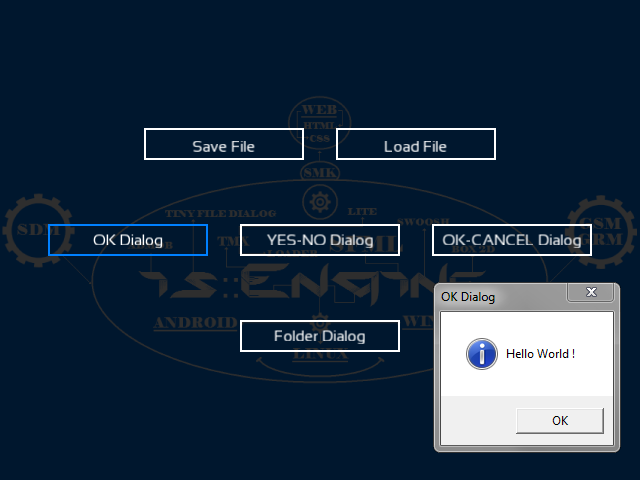
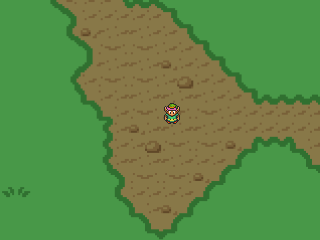
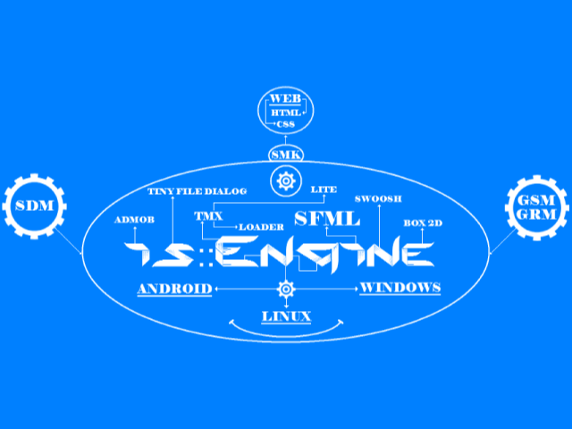

# is::Engine 3.2 Example Pack
This repository contains examples that show how to use the various features of the game engine.

## Virtual Game Pad

## Box 2D

## Admob

## Tiny File Dialog

## Game Slider

## Transition Effect

## TMXLite

