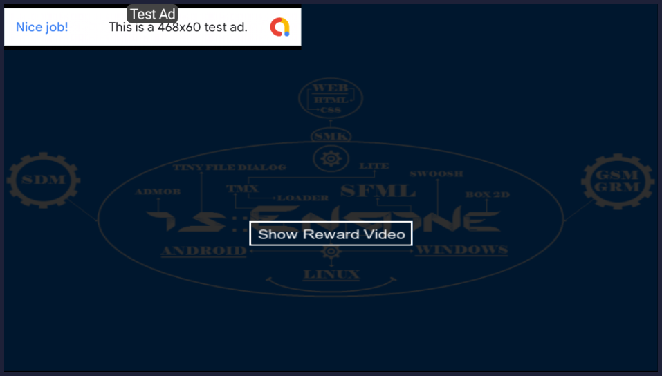
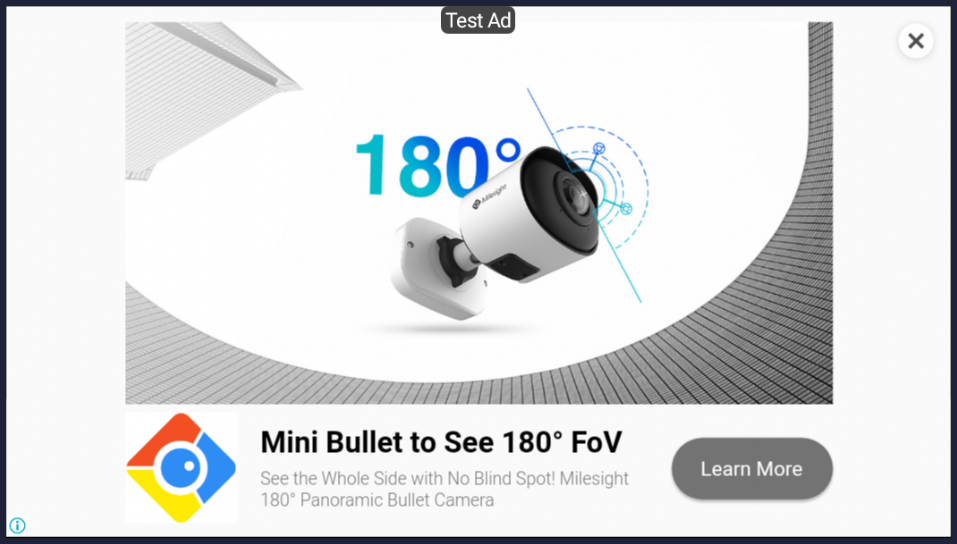

# is::Engine Admob
### Compatible Platforms:
- Android

### Supported tools:
- [Android Studio](https://github.com/Is-Daouda/is-Engine#-android-studio)

### Description:
- This example shows you how to use **Ad Manager (Admob)** to display **banner ad and video reward ad**. It also shows you how to use the **Button component** of the framework.
- You can set the ads information (id, banner size, keywords) in **[GameConfig.h](./app/src/main/cpp/app_src/config/GameConfig.h#L100)**.

## To make this example work you need:
- The **google-services.json** file for Android that you can get **[here](https://support.google.com/firebase/answer/7015592)** by following the procedure **(Once obtained put it in the [app](./app/) folder)**.
- Download the **Firebase C++ SDK 4.5.0 [here](https://drive.google.com/file/d/10CPcqvHkeFfMAbcwrnAltfZszpyk9eOo/view?usp=sharing)** (Please note this is an old version) and install it in the **sources directory** of **Android NDK (C:/Android/NDK/sources/firebase_cpp_sdk)**.

## Banner Ad

## Reward Video
