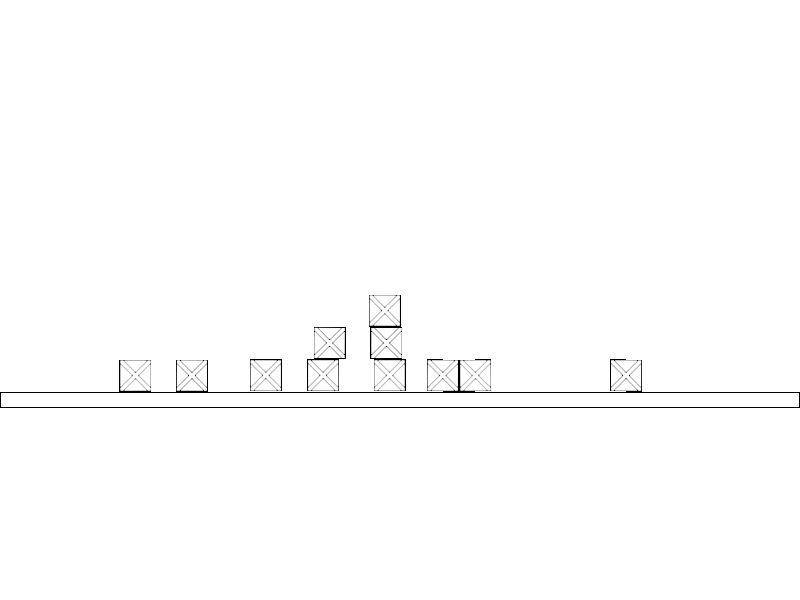

# is::Engine Box 2D
### Compatible Platforms:
- Android
- Web (HTML 5 - CSS 3)
- Windows / Linux

### Supported tools:
- [Android Studio](https://github.com/Is-Daouda/is-Engine#-android-studio)
- [Code::Blocks](https://github.com/Is-Daouda/is-Engine#-codeblocks)
- [CMake](https://github.com/Is-Daouda/is-Engine#-cmake)
- [Emscripten](https://github.com/Is-Daouda/is-Engine#-web-html-5---css-3)
- [Qt](https://github.com/Is-Daouda/is-Engine#-qt-creator)
- [Visual Studio Code](https://github.com/Is-Daouda/is-Engine#-visual-studio-code)

### Description:
- This example shows you how to use the **Box 2D** library with the framework to simulate physics in a game.
- In this example you use the **mouse (or touch on Android)** to create Blocks that overlay each other.
- This example was created thanks to the tutorial of the site **[veendeta.wordpress.com](https://veendeta.wordpress.com/2012/02/16/tutorial-getting-started-with-box2d/)** please consult it for more information.

