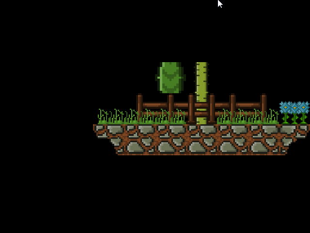

# is::Engine TMXLite
### Compatible Platforms:
- Android (Doesn’t work on my emulator yet but maybe it will work for you ¯\_(ツ)_/¯ )
- Windows / Linux

### Supported tools:
- [Android Studio](https://github.com/Is-Daouda/is-Engine#-android-studio)
- [Code::Blocks](https://github.com/Is-Daouda/is-Engine#-codeblocks)
- [CMake](https://github.com/Is-Daouda/is-Engine#-cmake)
- [Qt](https://github.com/Is-Daouda/is-Engine#-qt)
- [Visual Studio Code](https://github.com/Is-Daouda/is-Engine#-visual-studio-code)

### Description:
- This example shows you how to use **TMXLite** library with the framework to display tiles.

