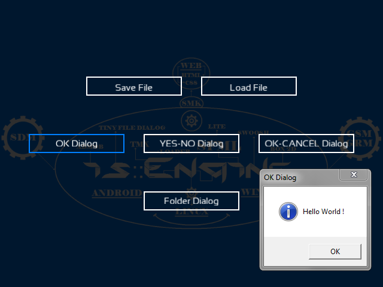

# is::Engine TinyFileDialog
### Compatible Platforms:
- Windows / Linux

### Supported tools:
- [Code::Blocks](https://github.com/Is-Daouda/is-Engine#-codeblocks)
- [CMake](https://github.com/Is-Daouda/is-Engine#-cmake)
- [Qt](https://github.com/Is-Daouda/is-Engine#-qt)
- [Visual Studio Code](https://github.com/Is-Daouda/is-Engine#-visual-studio-code)

### Description:
This example shows you how to use the **TinyFileDialog** library to display these types of **dialog boxes: information message, load / save a file, open a folder, ask a question**. It also shows you how to use the **Button component** of the framework.

