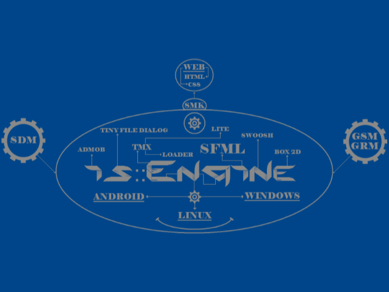
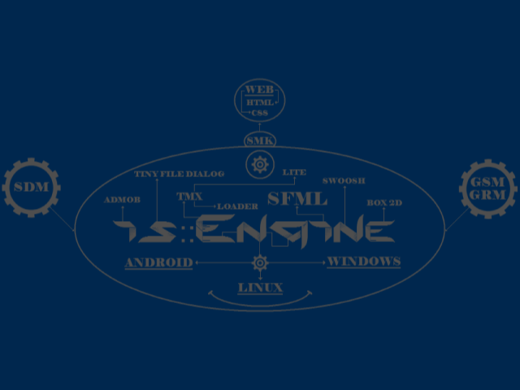

# is::Engine Transition Effect
### Compatible Platforms:
- Android
- Web (HTML 5 - CSS 3)
- Windows / Linux

### Supported tools:
- [Android Studio](https://github.com/Is-Daouda/is-Engine#-android-studio)
- [Code::Blocks](https://github.com/Is-Daouda/is-Engine#-codeblocks)
- [CMake](https://github.com/Is-Daouda/is-Engine#-cmake)
- [Emscripten](https://github.com/Is-Daouda/is-Engine#-web-html-5---css-3)
- [Qt](https://github.com/Is-Daouda/is-Engine#-qt)
- [Visual Studio Code](https://github.com/Is-Daouda/is-Engine#-visual-studio-code)

### Description:
This example shows you how to make **FADE OUT** and **FADE IN** transition effect with the framework.

