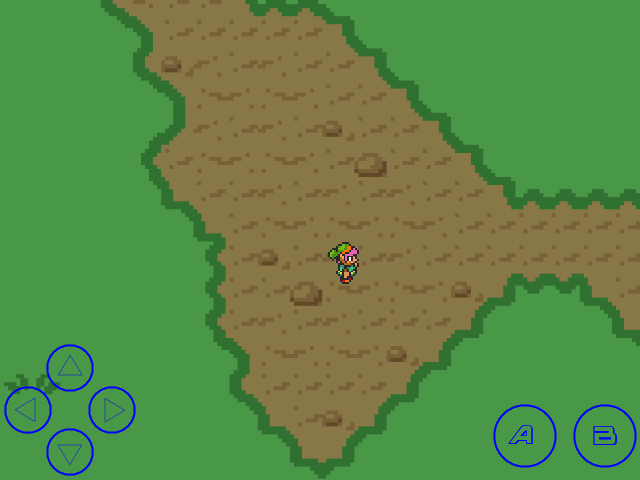
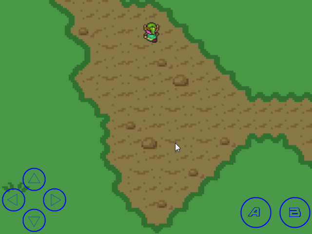
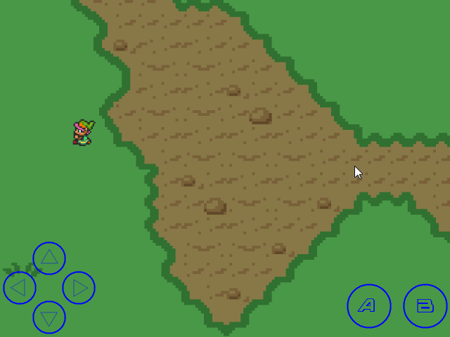

# is::Engine Virtual Game Pad
### Compatible Platforms:
- Android
- Web (HTML 5 - CSS 3)
- Windows / Linux

### Supported tools:
- [Android Studio](https://github.com/Is-Daouda/is-Engine#-android-studio)
- [Code::Blocks](https://github.com/Is-Daouda/is-Engine#-codeblocks)
- [CMake](https://github.com/Is-Daouda/is-Engine#-cmake)
- [Emscripten](https://github.com/Is-Daouda/is-Engine#-web-html-5---css-3)
- [Qt](https://github.com/Is-Daouda/is-Engine#-qt)
- [Visual Studio Code](https://github.com/Is-Daouda/is-Engine#-visual-studio-code)

### Description:
- This example shows you how to use the **GameKeyData** to control a character. It also shows you how to animate an object with the framework's **animation engine**.
- **GameKeyData**: is a component which allows to control the game thanks to **Virtual Keys on the screen** on Android (you can change the position of the keys, the transparency) and on PC / Web with the **Keys of the Keyboard** (you can configure these keys in **[GameConfig.h](./app/src/main/cpp/app_src/config/GameConfig.h#L51)**).

